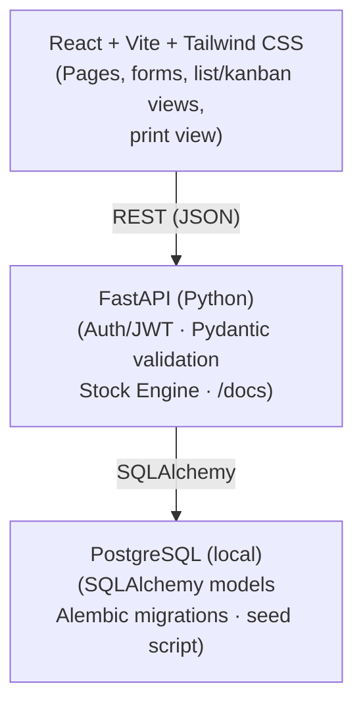
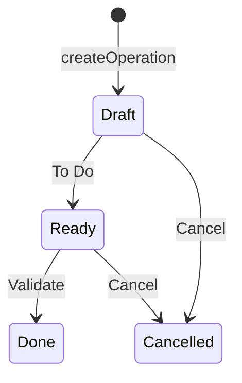
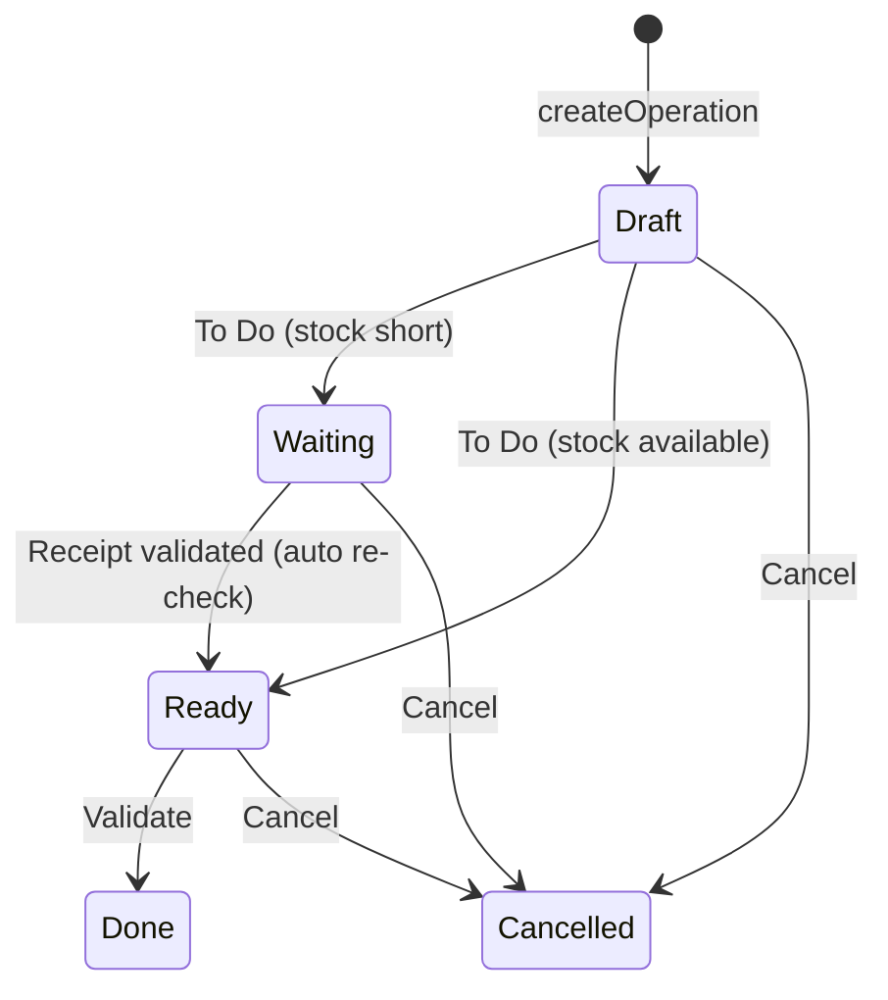

# StockSense — Inventory Management System

> **Odoo × GCET Hyderabad Hackathon 2026**  
> Virtual Round · 26 Sep 2026 · 9:00 AM – 5:00 PM IST  
> Repository: https://github.com/Humera-tech/StockSense-Odoo

---

## Table of Contents

1. [Project Overview](#project-overview)
2. [Problem Statement](#problem-statement)
3. [Solution](#solution)
4. [Key Features](#key-features)
5. [Inventory Flow](#inventory-flow)
6. [Architecture](#architecture)
7. [Tech Stack](#tech-stack)
8. [Core Data Model](#core-data-model)
9. [Stock Engine & Inventory Logic](#stock-engine--inventory-logic)
10. [Operation Lifecycles](#operation-lifecycles)
11. [API Overview](#api-overview)
12. [Project Structure](#project-structure)
13. [Local Setup](#local-setup)
14. [Demo Flow](#demo-flow)
15. [Team & Responsibilities](#team--responsibilities)
16. [Git Workflow](#git-workflow)
17. [Definition of Done](#definition-of-done)

---

## Project Overview

**StockSense** is a modular Inventory Management System built for the Odoo × GCET Hyderabad Hackathon 2026. The goal is to ship a working, demo-able app covering every screen in the StockSense mockup — auth, dashboard, stock, receipts, deliveries, adjustments, move history, warehouses, and locations — backed by a real local PostgreSQL database and a transactional stock engine.

> **Correctness of stock numbers beats visual extras.**

---

## Problem Statement

Businesses tracking inventory through manual registers, spreadsheets, or disconnected tools face:

- No real-time visibility into stock levels across locations
- Error-prone manual updates causing stock mismatches
- No audit trail for stock movements
- Inability to coordinate receipts, deliveries, and internal transfers

**Target users:** Inventory Managers and Warehouse Staff.

---

## Solution

StockSense centralizes all stock operations in one place. Every movement is recorded in an immutable **Stock Ledger**. Stock quantities are always derived from validated operations — no silent overwrites. Every manual edit creates an auditable adjustment move.

---

## Key Features

| Priority | Feature |
|----------|---------|
| **P0** | Login / Sign up with server-enforced validation rules |
| **P0** | Warehouse + Location settings (CRUD) |
| **P0** | Products & stock page (editable; shows **On Hand** / **Free to Use**) |
| **P0** | Receipts — list, form, Draft → Ready → Done lifecycle |
| **P0** | Deliveries — list, form, Draft → **Waiting** → **Ready** → Done lifecycle |
| **P0** | Auto-generated references (`WH/IN/0001`, `WH/OUT/0001`) |
| **P0** | Transactional stock updates on Validate |
| **P0** | Move History list |
| **P0** | Dashboard KPI cards |
| **P1** | Kanban view toggle by status |
| **P1** | Search by reference & contact |
| **P1** | Out-of-stock red line + alert on delivery form |
| **P1** | Print receipt when Done |
| **P1** | Inventory Adjustments |
| **P1** | Forgot password (OTP-based reset) |
| **P2** | Low-stock highlight on stock page |
| **P2** | CSV export of move history |
| **P2** | Dark mode |
| **P2** | Cancel flow polish |

---

## Inventory Flow

```
Step 1 — Receive Goods from Vendor
  Receive 100 kg Steel  →  Stock: +100

Step 2 — Internal Transfer
  Main Store → Production Rack
  Total stock unchanged; location updated

Step 3 — Deliver Finished Goods
  Deliver 20 kg Steel  →  Stock: −20

Step 4 — Adjust Damaged Items
  3 kg Steel damaged  →  Stock: −3
```

Every movement is logged in the **Stock Ledger** (`stock_moves` table). Ledger rows are immutable.

---

## Architecture



**Monorepo layout:** `frontend/` (React) · `server/` (FastAPI, planned)  
**API contract:** FastAPI auto-generated `/docs` (Swagger UI)  
**Runs fully offline** — no cloud dependencies.

---

## Tech Stack

| Layer | Choice |
|-------|--------|
| **Frontend** | React 19, TypeScript, Vite, Tailwind CSS v4, React Router, TanStack Query, react-hook-form + zod |
| **Backend** | Python 3.11+, FastAPI, Uvicorn, Pydantic v2, SQLAlchemy 2.0, Alembic, passlib[bcrypt], python-jose (JWT), pytest |
| **Database** | PostgreSQL (local) · SQLite acceptable as fallback via `DATABASE_URL` |
| **Tooling** | GitHub, branch protection on `main`, ESLint + Prettier, docker-compose |

> **Note:** React Router, TanStack Query, react-hook-form, and zod are planned dependencies not yet in `package.json`. The backend (`server/`) has not been scaffolded yet.

---

## Core Data Model

| Table | Key Fields | Notes |
|-------|-----------|-------|
| `users` | `id`, `login_id` (unique), `email` (unique), `password_hash`, `name` | Responsible on operations |
| `warehouses` | `id`, `name`, `short_code` (unique), `address` | Seed: `WH` – Main Warehouse |
| `locations` | `id`, `name`, `short_code`, `warehouse_id`, `type` | `type`: `INTERNAL \| VENDOR \| CUSTOMER \| ADJUSTMENT`; seed `WH/Stock1`, `WH/Stock2` + virtual locations |
| `contacts` | `id`, `name`, `kind` (`VENDOR/CUSTOMER`), `address` | e.g. Azure Interior |
| `products` | `id`, `sku`, `name`, `unit_cost`, `uom` | Displayed as `[DESK001] Desk` |
| `stock_quants` | `product_id`, `location_id`, `quantity` — unique(product, location) | Current stock. **Only the stock engine writes here.** |
| `operations` | `id`, `reference` (unique), `type` (`IN/OUT/ADJ`), `warehouse_id`, `contact_id`, `src_location_id`, `dest_location_id`, `scheduled_date`, `status`, `responsible_id`, `done_at` | Receipts, deliveries, and adjustments share one table |
| `operation_lines` | `id`, `operation_id`, `product_id`, `quantity`, `reserved_qty` | `reserved_qty` drives **Free to Use** and **Waiting** |
| `stock_moves` | `id`, `operation_id`, `reference`, `product_id`, `from_location_id`, `to_location_id`, `quantity`, `date` | Immutable ledger → Move History. One row per product line. |
| `sequences` | `warehouse_id`, `op_type`, `next_number` | Generates `WH/IN/0001` etc. inside the create transaction |

### Key Derived Values

| Field | Calculation |
|-------|------------|
| **On Hand** | `SUM(stock_quants.quantity)` across internal locations |
| **Free to Use** | On Hand − qty reserved by **Ready** deliveries |
| **Waiting** | Delivery where ≥1 line has insufficient free stock |
| **Late** | `scheduled_date < today` AND status ≠ Done/Cancelled |

---

## Stock Engine & Inventory Logic

All stock writes go through a single service (`services/stock.py`). Every write runs in a database transaction.

### `createOperation(type, data)`
- Locks the `sequences` row for the warehouse + op type
- Builds reference `<WH short code>/<IN|OUT>/<0001>`
- Inserts operation + lines as **Draft**; sets `responsible = current user`

### `markTodo(op)` — Draft → Ready / Waiting
- **Receipt:** transitions directly to **Ready**
- **Delivery:** checks free qty per line at the source location
  - All lines covered → **Ready** (quantities reserved)
  - Any short line → **Waiting**; short lines flagged red in the UI

### `validate(op)` — Ready → Done
- Allowed only from **Ready**
- Updates `stock_quants` (`+` at destination for IN, `−` at source for OUT)
- Inserts one `stock_moves` row per line; sets `status = Done` + `done_at`
- After any receipt validates: **re-checks all Waiting deliveries** for newly available stock

### `adjust(product, location, countedQty)`
- `diff = counted − current`
- Posts an **ADJ** operation (already Done) with a move from/to the virtual Adjustment location
- The editable stock page calls this — never a silent overwrite

### Guards

| Rule | Behaviour |
|------|-----------|
| No negative quants | Blocked at engine level |
| Quantity must be integer > 0 | Pydantic + engine |
| Cannot edit lines after Done | HTTP 400 |
| Cannot validate from Waiting | HTTP 400 |
| Cannot cancel Done | HTTP 400 |
| Cancel from any other state | Releases all reservations |

---

## Operation Lifecycles

### Receipt



### Delivery



> Cancel is allowed from any state **except Done**. Cancelling releases all reservations.

---

## API Overview

All errors return `{ error: { field, message } }` so forms can highlight the offending input.

| Method & Route | Purpose |
|---------------|---------|
| `POST /api/auth/signup` | Register (full validation) |
| `POST /api/auth/login` | Authenticate, return JWT |
| `POST /api/auth/forgot` | OTP-based password reset |
| `GET /api/auth/me` | Current user |
| `GET/POST/PUT/DELETE /api/warehouses` | Warehouse CRUD |
| `GET/POST/PUT/DELETE /api/locations` | Location CRUD |
| `GET/POST/PUT /api/products` | Product master data |
| `GET /api/contacts` | Contact list |
| `GET /api/stock?search=` | On Hand / Free to Use per product |
| `POST /api/stock/adjust` | In-place stock edit (creates ADJ operation) |
| `GET /api/dashboard` | `{ receipts: {toReceive, late, operations}, deliveries: {toDeliver, late, waiting, operations} }` |
| `GET /api/operations?type=IN\|OUT&status=&q=` | Filtered list (search by reference & contact) |
| `GET /api/operations/:id` | Detail |
| `POST /api/operations` | Create Draft with lines |
| `PUT /api/operations/:id` | Edit Draft |
| `POST /api/operations/:id/todo` | → Ready / Waiting |
| `POST /api/operations/:id/validate` | → Done |
| `POST /api/operations/:id/cancel` | Cancel |
| `GET /api/moves?q=&type=` | Move history ledger |

### Validation Rules

| Field | Rule | Message |
|-------|------|---------|
| Login ID | 6–12 chars, unique | "Login ID must be 6–12 characters" / "Login ID already taken" |
| Email | Valid format, unique | "Enter a valid email" / "Email already registered" |
| Password | > 8 chars, ≥1 lower, ≥1 upper, ≥1 special | Live checklist under field |
| Re-enter password | Must match | "Passwords do not match" |
| Short code | Uppercase alphanumeric, unique | "Short code already exists" |
| Operation lines | qty integer > 0, no duplicate product | Inline under offending line |
| Stock edit | Counted qty integer ≥ 0 | "Quantity cannot be negative" |

**Server (Pydantic) is the source of truth.** Client-side (zod) rules mirror server rules for fast feedback only.

---

## Project Structure

```
StockSense-Odoo/
├── frontend/                    # React + TypeScript + Vite (Tailwind CSS v4)
│   └── src/
│       ├── pages/
│       │   ├── auth/            # Login, Signup, ForgotPassword, VerifyOTP
│       │   ├── operations/      # Receipts, Deliveries, Adjustments, Transfers, MoveHistory
│       │   ├── products/        # Products, ProductDetails
│       │   ├── settings/        # Warehouse
│       │   ├── profile/
│       │   └── Dashboard.tsx
│       ├── components/
│       │   ├── layout/          # Header, Sidebar
│       │   ├── operations/      # ReceiptForm, DeliveryForm, AdjustmentForm, TransferForm
│       │   ├── dashboard/       # DashboardKPI, DashboardFilters, RecentOperations, StockAlerts
│       │   └── products/
│       ├── context/             # AuthContext
│       ├── routes/              # AppRoutes, ProtectedRoute
│       ├── services/            # authService, inventoryService
│       ├── types/               # auth, inventory, product
│       └── data/                # mockData (placeholder)
└── server/                      # FastAPI backend (planned)
    ├── routers/
    ├── services/
    │   └── stock.py             # Stock Engine
    ├── models/                  # SQLAlchemy ORM
    └── schemas/                 # Pydantic schemas
```

> **Current state:** Backend API, stock engine (receipts, deliveries with reservations/Waiting, cancel), seed data, and the frontend auth, receipts, deliveries, stock and settings screens are implemented. Adjustments, dashboard counts and move history are next.

---

## Local Setup

> The app is designed to run **fully offline** — no cloud services required.

### Frontend

```bash
git clone https://github.com/Humera-tech/StockSense-Odoo.git
cd StockSense-Odoo/frontend
npm install
npm run dev
```

Frontend dev server: `http://localhost:5173`

### Backend

```bash
# Start PostgreSQL (from the repo root)
docker compose up -d

# Install, migrate, seed, run
cd server
python -m venv .venv
.venv\Scripts\activate          # macOS/Linux: source .venv/bin/activate
pip install -r requirements.txt
cp .env.example .env
alembic upgrade head
python -m app.seed
uvicorn app.main:app --reload
```

API + Swagger UI: `http://localhost:8000/docs` · Demo login: **`admin01` / `Admin@1234`**

The frontend dev server proxies `/api` to `localhost:8000`, so start the backend first.

> **SQLite fallback:** Set `DATABASE_URL=sqlite:///./stocksense.db` in `server/.env` if Docker is unavailable.

> **Reset demo data:** `alembic downgrade base && alembic upgrade head && python -m app.seed`

> **Tests:** `cd server && pytest`

---

## Demo Flow

1. **Auth** — Sign up with an invalid password → live rule errors. Sign up correctly. Wrong login → "Invalid Login Id or Password". Log in.

2. **Settings** — View warehouse `WH` and locations `WH/Stock1`, `WH/Stock2`. Add a new location.

3. **Stock Page** — `Desk` shows **On Hand: 50 / Free to Use: 45** (5 reserved by a Ready delivery). Edit On Hand to 48 → adjustment appears in Move History.

4. **Receipt** — New → reference auto-fills `WH/IN/0003`, responsible auto-set. Add 10 Desks from Azure Interior → **To Do** → **Validate** → **Print**. On Hand becomes 58.

5. **Delivery** — Order 70 Desks → **To Do** → line turns red + alert, status **Waiting**. Validate the receipt above → delivery auto-moves to **Ready** → **Validate**.

6. **Move History** — IN rows in green, OUT rows in red. Multi-product references split per row. Switch to kanban. Search by "Azure".

7. **Dashboard** — KPI counts update live. Click **Late** to open filtered list. Resize to 375 px to show responsiveness.

---

## Team & Responsibilities

| Member | Role | Owns | Branches |
|--------|------|------|----------|
| **Hamza** | Backend — Data & Stock Engine | SQLAlchemy models, Alembic migrations, sequence generator, stock engine (`create / todo / validate / cancel`, reservations, Waiting re-check, adjustments), move ledger, dashboard queries, pytest | `feat/models` · `feat/stock-engine` · `feat/dashboard-queries` |
| **Mahreen** | Backend — FastAPI Layer | FastAPI app structure, routers, Pydantic schemas, auth (signup/login/JWT/forgot), master-data CRUD, operations/moves/dashboard/stock endpoints, CORS, error format | `feat/api-skeleton` · `feat/auth-api` · `feat/master-data-api` · `feat/operations-api` |
| **Asad** | Frontend | Theme tokens, layout shell, reusable `OperationList` (list + kanban + search), Receipt & Delivery forms, line editor, red-line alert, Dashboard, Move History, print view, responsive pass | `feat/ui-shell` · `feat/operation-list` · `feat/operation-form` · `feat/dashboard-ui` · `feat/move-history` |
| **Lateef** | Deployment + Frontend Support | Repo setup, branch protection, docker-compose, `.env.example`, seed script, README, QA. Builds simpler screens (~10:30 onwards): Login/Sign up/Forgot password UI, Settings (warehouse, location), Stock page | `chore/repo-setup` · `chore/docker` · `chore/seed` · `feat/auth-ui` · `feat/settings-ui` · `feat/stock-ui` · `docs/readme` |

**Backend contract:** Hamza exposes plain Python functions in `services/stock.py` (e.g. `validate_operation(db, op_id, user)`) that raise typed errors. Mahreen's routers parse/validate input, call these functions, and map errors to HTTP responses. Neither edits the other's files.

---

## Git Workflow

- `main` is **always runnable**. No direct pushes to `main`.
- Each task = `feat/*` branch → PR → one review → merge (squash-free; individual commits kept visible).
- Commit small and often: `feat(stock): reserve qty on delivery todo`
- Target **10+ commits per person** — contributor graphs are a judged criterion.
- **Model changes only via Alembic migrations**, owned exclusively by Hamza.
- **Merge windows:** 11:00 · 12:30 · 14:30 · 15:30 · 16:20 — rebase on `main` after each.
- **Feature freeze: 16:20.** Tag `v1.0`, submit by 16:50.

---

## Definition of Done

- [ ] Every mockup screen reachable from the menu and working against the real database
- [ ] Receipt and delivery lifecycles — including **Waiting** — update stock correctly
- [ ] References auto-increment per warehouse and type (`WH/IN/0001`, `WH/OUT/0001`)
- [ ] All sign-up/login rules enforced server-side with clear error messages
- [ ] List + kanban + search on Receipts, Deliveries, and Move History
- [ ] Responsive at 375 px, one consistent color scheme
- [ ] README with setup steps, stack, and schema; fresh clone runs in under 5 minutes
- [ ] Commits from all team members, merged via PR
